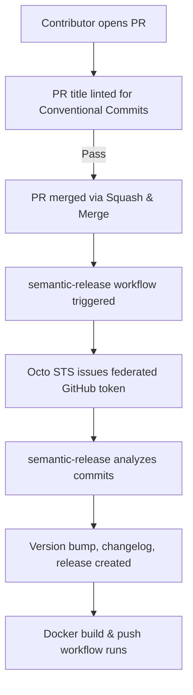

# semantic-release Implementation Guide

## Introduction

This project uses [semantic-release](https://semantic-release.gitbook.io/semantic-release/) to automate versioning and changelog generation based on conventional commit messages. This ensures consistent, reliable, and hands-off releases for the `sample-go` repository.

---

## Implementation Details

### Key Files in the Repository

- [`.releaserc.yaml`](file:///Users/jburns/git/sample-go/.releaserc.yaml): semantic-release configuration.
- [`.github/chainguard/semantic-release.sts.yaml`](file:///Users/jburns/git/sample-go/.github/chainguard/semantic-release.sts.yaml): Octo STS trust policy for federated GitHub App tokens.
- [`.github/workflows/semantic-release.yaml`](file:///Users/jburns/git/sample-go/.github/workflows/semantic-release.yaml): GitHub Actions workflow for semantic-release.
- [`.github/workflows/docker-build.yaml`](file:///Users/jburns/git/sample-go/.github/workflows/docker-build.yaml): Docker build and push workflow.
- [`.github/workflows/enforce-pr-conventional-commits.yaml`](file:///Users/jburns/git/sample-go/.github/workflows/enforce-pr-conventional-commits.yaml): PR title linter for conventional commits.

### External References

- [semantic-release documentation](https://semantic-release.gitbook.io/semantic-release/)
- [Octo STS](https://github.com/apps/octo-sts) ([docs](https://github.com/liatrio/octo-sts-guide))
- [action-semantic-pull-request](https://github.com/amannn/action-semantic-pull-request)
- [GitHub: Configure commit squashing](https://docs.github.com/en/repositories/configuring-branches-and-merges-in-your-repository/configuring-pull-request-merges/configuring-commit-squashing-for-pull-requests)

---

## Key Design Decisions & Trade-offs

- **Federated Auth with Octo STS:** Used for secure, fine-grained GitHub token permissions. Requires installing the [Octo STS app](https://github.com/apps/octo-sts) and configuring branch protection to allow bypass.
- **Conventional Commits Enforcement:** PR titles are linted for compliance, ensuring semantic-release can determine the correct version bump.
- **Squash & Merge:** Enabled to ensure a single, conventional commit per PR, simplifying release automation.
- **Branch Protection:** Enforced to require PRs and status checks before merging, increasing release safety.
- **No Version in Source:** semantic-release manages versioning via tags, not by updating files in the repo, reducing merge conflicts and manual errors.

---

## Diagram: Workflow Overview

---

## Summary of Steps

- Added semantic-release config and workflows.
- Integrated Octo STS for secure token management.
- Enforced PR title linting for conventional commits.
- Enabled squash & merge with PR title as commit message.
- Set up branch protection and required status checks.
- Communicated new PR requirements to contributors.

---

## Next Steps

- [ ] Install the [Octo STS app](https://github.com/apps/octo-sts).
- [ ] Update branch protection to allow Octo STS bypass.
- [ ] Ensure all contributors follow PR title conventions.