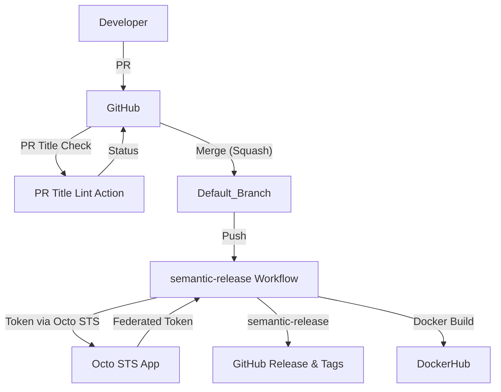

# semantic-release Implementation Guide

## Introduction

This documentation describes how semantic-release was implemented in the `jburns24/sample-go` repository to automate versioning and releases based on conventional commits. The setup ensures consistent, automated releases and enforces commit message standards for all contributors.

---

## Implementation Details

### Key Files in the Repository

- [`.releaserc.yaml`](file:///Users/jburns/git/sample-go/.releaserc.yaml): semantic-release configuration.
- [`.github/chainguard/semantic-release.sts.yaml`](file:///Users/jburns/git/sample-go/.github/chainguard/semantic-release.sts.yaml): Octo STS trust policy for GitHub Actions.
- [`.github/workflows/semantic-release.yaml`](file:///Users/jburns/git/sample-go/.github/workflows/semantic-release.yaml): GitHub Actions workflow for semantic-release.
- [`.github/workflows/docker-build.yaml`](file:///Users/jburns/git/sample-go/.github/workflows/docker-build.yaml): Docker build and push workflow.
- [`.github/workflows/enforce-pr-conventional-commits.yaml`](file:///Users/jburns/git/sample-go/.github/workflows/enforce-pr-conventional-commits.yaml): Enforces PR title conventions.

### External References

- [semantic-release documentation](https://semantic-release.gitbook.io/semantic-release/)
- [Octo STS](https://github.com/apps/octo-sts)
- [action-semantic-pull-request](https://github.com/amannn/action-semantic-pull-request)
- [GitHub: Configure commit squashing](https://docs.github.com/en/repositories/configuring-branches-and-merges-in-your-repository/configuring-pull-request-merges/configuring-commit-squashing-for-pull-requests)

### Setup Steps

1. **semantic-release Configuration**: `.releaserc.yaml` defines release branches and plugins.
2. **Octo STS Integration**: 
   - Install the [Octo STS app](https://github.com/apps/octo-sts).
   - Configure branch protections to allow Octo STS to bypass them.
   - Trust policy in `.github/chainguard/semantic-release.sts.yaml`.
3. **GitHub Actions Workflows**:
   - `semantic-release.yaml` runs semantic-release on pushes to the default branch.
   - `docker-build.yaml` automates Docker image builds and pushes.
   - `enforce-pr-conventional-commits.yaml` uses [action-semantic-pull-request](https://github.com/amannn/action-semantic-pull-request) to enforce PR title conventions.
4. **Repository Settings**:
   - Enable "Squash and merge" for PRs.
   - Set default squash commit message to use the PR title.
   - Require status checks (including PR title lint) before merging.
   - Communicate PR title requirements to contributors.

---

## Key Design Decisions & Trade-offs

- **Automated Releases**: semantic-release ensures releases are triggered only by meaningful changes, reducing manual errors.
- **Security**: Octo STS is used for secure token federation, allowing workflows to push releases even with branch protections.
- **Enforced Standards**: PR titles must follow [Conventional Commits](https://www.conventionalcommits.org/), ensuring changelogs and versioning are accurate.
- **Squash Merging**: Using squash merges with PR titles as commit messages ensures clean, conventional commit history.
- **Trade-off**: Additional setup is required for Octo STS and branch protection rules, but this increases security and automation reliability.

---

## Component Interaction Diagram

---

## Summary of Actions

- Created semantic-release and Octo STS configuration files.
- Added GitHub Actions workflows for release, Docker build, and PR title enforcement.
- Enabled squash merging and set PR title as default commit message.
- Enforced PR title conventions with action-semantic-pull-request.
- Configured branch protection and Octo STS bypass.
- Communicated new PR requirements to contributors.

---

For more details, see the linked files and external documentation above.