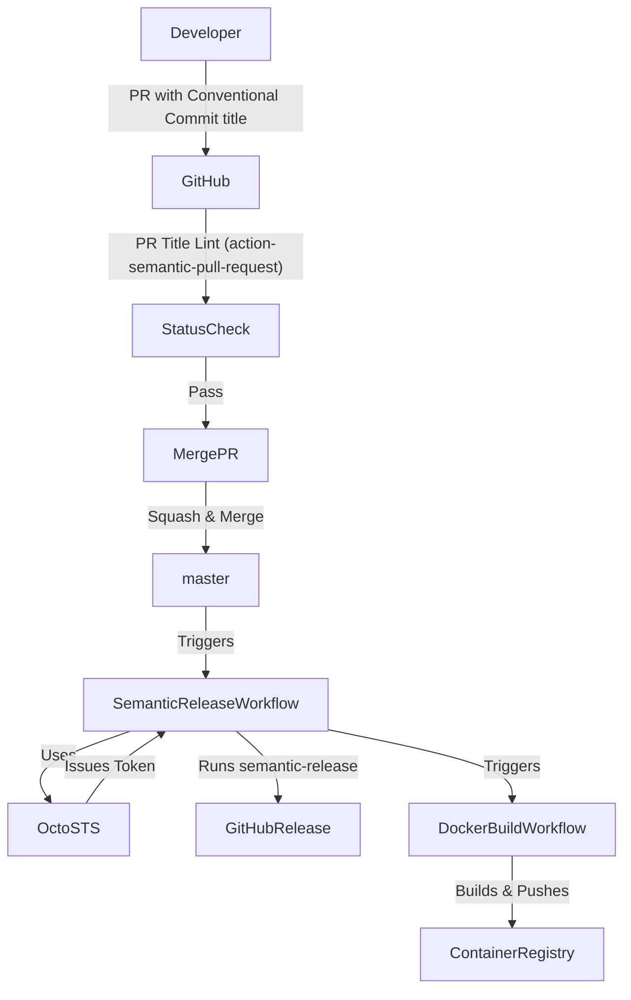

# semantic-release Implementation Guide

## Introduction

This project uses [semantic-release](https://semantic-release.gitbook.io/semantic-release/) to automate versioning and releases based on commit messages. This ensures consistent, reliable, and hands-off releases, following [Semantic Versioning](https://semver.org/) and the [Conventional Commits](https://www.conventionalcommits.org/) specification.

---

## Implementation Details

### Key Files in the Repository

- [`.releaserc.yaml`](file:///Users/jburns/git/sample-go/.releaserc.yaml): semantic-release configuration.
- [`.github/chainguard/semantic-release.sts.yaml`](file:///Users/jburns/git/sample-go/.github/chainguard/semantic-release.sts.yaml): Octo STS trust policy for federated GitHub App tokens.
- [`.github/workflows/semantic-release.yaml`](file:///Users/jburns/git/sample-go/.github/workflows/semantic-release.yaml): GitHub Actions workflow for releases.
- [`.github/workflows/docker-build.yaml`](file:///Users/jburns/git/sample-go/.github/workflows/docker-build.yaml): Docker build and push workflow.
- [`.github/workflows/enforce-pr-conventional-commits.yaml`](file:///Users/jburns/git/sample-go/.github/workflows/enforce-pr-conventional-commits.yaml): Enforces PR titles to follow Conventional Commits.

### External References

- [semantic-release documentation](https://semantic-release.gitbook.io/semantic-release/)
- [Octo STS](https://github.com/liatrio/octo-sts-guide)
- [action-semantic-pull-request](https://github.com/amannn/action-semantic-pull-request)
- [GitHub: Configure commit squashing](https://docs.github.com/en/repositories/configuring-branches-and-merges-in-your-repository/configuring-pull-request-merges/configuring-commit-squashing-for-pull-requests)

---

## Key Design Decisions & Trade-offs

- **Automated Releases:** semantic-release automates versioning and changelog generation, reducing manual errors.
- **Conventional Commits Enforcement:** PR titles must follow the Conventional Commits spec, enforced via GitHub Actions.
- **Squash & Merge:** Enabled in repo settings to ensure a clean commit history and that PR titles drive release notes.
- **Branch Protection:** Configured to require PRs and passing status checks before merging to `master`.
- **Octo STS Integration:** Used for secure, federated GitHub App tokens, allowing workflows to bypass branch protections when needed.
- **No Version Bumps in Source:** semantic-release manages versions via tags, not by updating files in the repo, simplifying merge conflicts and reducing complexity.

---

## Component Interaction Diagram

---

## Summary of Steps

- Added semantic-release config and workflows.
- Integrated Octo STS for secure token handling.
- Enforced PR title conventions.
- Enabled squash & merge with PR title as default commit message.
- Set up branch protection and status checks.
- Communicated new PR requirements to contributors.

---

## Next Steps

- [Install the Octo STS app](https://github.com/apps/octo-sts).
- Update branch protection rules to allow Octo STS to bypass if needed.
- Ensure all contributors are aware of PR title requirements.