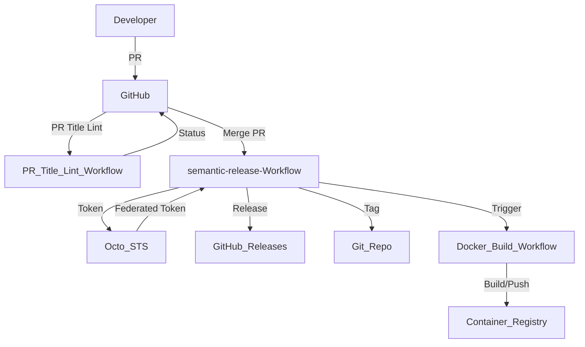

# semantic-release Implementation Guide

## Introduction

This project uses [semantic-release](https://semantic-release.gitbook.io/semantic-release/) to automate versioning and changelog generation based on commit messages. This ensures consistent releases, reduces manual effort, and enforces best practices for commit and PR titles.

---

## Implementation Details

### Key Files in the Repository

- [.releaserc.yaml](file:///Users/jburns/git/sample-go/.releaserc.yaml): Main semantic-release configuration.
- [.github/chainguard/semantic-release.sts.yaml](file:///Users/jburns/git/sample-go/.github/chainguard/semantic-release.sts.yaml): Octo STS trust policy for federated GitHub App tokens.
- [.github/workflows/semantic-release.yaml](file:///Users/jburns/git/sample-go/.github/workflows/semantic-release.yaml): GitHub Actions workflow for semantic-release.
- [.github/workflows/docker-build.yaml](file:///Users/jburns/git/sample-go/.github/workflows/docker-build.yaml): Docker build and push workflow.
- [.github/workflows/enforce-pr-conventional-commits.yaml](file:///Users/jburns/git/sample-go/.github/workflows/enforce-pr-conventional-commits.yaml): Enforces PR titles to follow [Conventional Commits](https://www.conventionalcommits.org/).

### External References

- [semantic-release documentation](https://semantic-release.gitbook.io/semantic-release/)
- [Octo STS](https://github.com/liatrio/octo-sts-guide)
- [action-semantic-pull-request](https://github.com/amannn/action-semantic-pull-request)
- [GitHub: Configure squash merging](https://docs.github.com/en/repositories/configuring-branches-and-merges-in-your-repository/configuring-pull-request-merges/configuring-commit-squashing-for-pull-requests)

---

## Key Design Decisions & Trade-offs

- **Automated Releases:** semantic-release automates versioning and changelog generation, reducing manual errors.
- **Commit/PR Title Enforcement:** PR titles must follow Conventional Commits, enforced via [amannn/action-semantic-pull-request](https://github.com/amannn/action-semantic-pull-request).
- **Squash & Merge:** Enabled in repo settings to ensure a single, clean commit per PR, using the PR title as the commit message.
- **Branch Protections:** Require PRs and status checks (including PR title linting) before merging to `master`.
- **Octo STS Integration:** Used for secure, federated GitHub App tokens, allowing workflows to bypass branch protections as needed.
- **Docker Workflow:** Separate workflow for building and pushing Docker images, using best practices for tagging and labeling.

---

## Component Interaction Diagram

---

## Summary of Actions

- Added semantic-release configuration and workflows.
- Integrated Octo STS for secure token management.
- Enforced Conventional Commit PR titles.
- Enabled squash & merge with PR title as commit message.
- Set up branch protections and required status checks.
- Communicated new PR requirements to contributors.

---

## Next Steps

- [ ] Install the [Octo STS GitHub App](https://github.com/apps/octo-sts).
- [ ] Update branch protection rules to allow Octo STS to bypass as needed.
- [ ] Ensure all contributors are aware of PR title requirements.